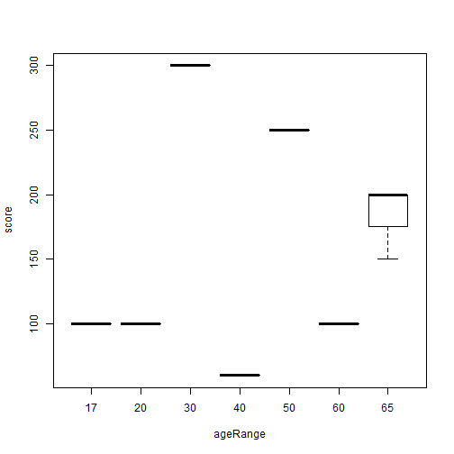

The Life Event Survey Tool
========================================================
author:David A York
date: January 31, 2016


The Investment
========================================================

The Project intends to provide both a client friendly data collection platform and a tool for database maintenance, manipulation and analysis.

- The Client-user facing part is a clear and simple survey taker and feedback application
- The How-tos for both client-user and investigator-user are concise and complete and integrated smoothly with the tool
- The complete tool collects, provides client feed back and outcome follow-up. As well the collected data are stored in simple comma-separated format which can be sent to the investigator site for study.
- simple view and analysis of the insitu data is provided by the tool and it's integrity can be assured.


The Tool
========================================================

- The tool is a complete data input, storage, analysis and maintenance application.
- The tool is secure when deployed,
  - zipcodes are converted immediately to census tract codes before storing
  - potential identifying data are encrypted
  - data can only be sent to a preselected addresses

_eg._ **A Simple Summary**

```
 ageRange     score      
 17:1     Min.   : 60.0  
 20:1     1st Qu.:100.0  
 30:1     Median :150.0  
 40:1     Mean   :162.2  
 50:1     3rd Qu.:200.0  
 60:1     Max.   :300.0  
 65:3                    
```

Other Simple Reports
=======================================================

 


The Payoff
========================================================
- Client-users have an easy survey to complete with immediate risk feedback as reward
- Survey collected unattended, 24x7
- Secure and confidential
- The application communicates, on demand, with the investigator, off site, to allow more complex analysis, presentation and ultimate publication.
