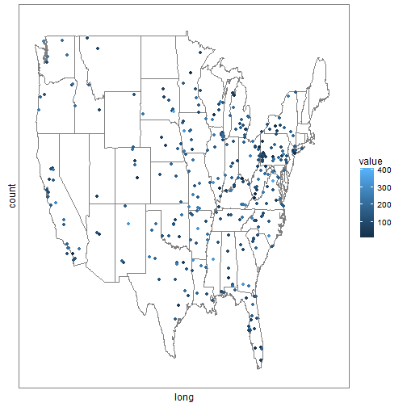

The Life Event Survey Tool
========================================================
author:David A York
date: January 31, 2016

The Investment
========================================================

The Project intends to provide both a client friendly data collection platform and a tool for database maintenance, manipulation and analysis.

- The Client-user facing part is a clear and simple survey taker and feedback application
- The How-tos for both client-user and investigator-user are concise and complete and integrated smoothly with the tool
- The complete tool collects, provides client feed back and outcome follow-up. As well the collected data are stored in simple comma-separated format which can be sent to the investigator site for study.
- simple view and analysis of the insitu data is provided by the tool and it's integrity can be assured.

The Tool
========================================================

- a free open source solution
- The tool is a complete data input, storage, analysis and maintenance application.
- The tool is secure when deployed,
  - zipcodes are converted immediately to census tract codes before storing
  - potential identifying data are encrypted
  - data can only be sent to a preselected addresses

**Database Excerpt**

|Date       |email                                       |Tract |Age Group | Score|
|:----------|:-------------------------------------------|:-----|:---------|-----:|
|10/17/2016 |libero.et.tristique@quisdiamluctus.net      |40146 |30        |   256|
|2/12/2015  |dui.nec@augue.org                           |17223 |17        |   184|
|6/20/2016  |molestie@molestietellusAenean.com           |49443 |60        |   187|
|11/13/2015 |lectus@pharetrautpharetra.edu               |39935 |17        |   123|
|7/7/2015   |lacus.Etiam@Aliquamvulputateullamcorper.net |37487 |60        |    49|

Simple Reports - Tables
=========================================================
  
**Summary**
 

|   |ageRange |    score     |   riskGroup |
|:--|:--------|:-------------|:------------|
|   |17:129   |Min.   :  1.0 |high    : 26 |
|   |20:120   |1st Qu.: 98.0 |low     :580 |
|   |30:101   |Median :148.0 |moderate:194 |
|   |40:118   |Mean   :152.6 |NA           |
|   |50:102   |3rd Qu.:205.2 |NA           |
|   |60:121   |Max.   :417.0 |NA           |
|   |65:109   |NA            |NA           |

Simple Reports - Plots
========================================================

 

Map Mean Score by Census Tract
 
 

The Payoff
========================================================

- simple, free, open-source solution to hosting the survey
- Client-users have an easy survey to complete with immediate risk feedback as reward
- Survey collected unattended, 24x7
- Secure and confidential
- The application communicates, on demand, with the investigator, off site, to allow more complex analysis, presentation and ultimate publication.

